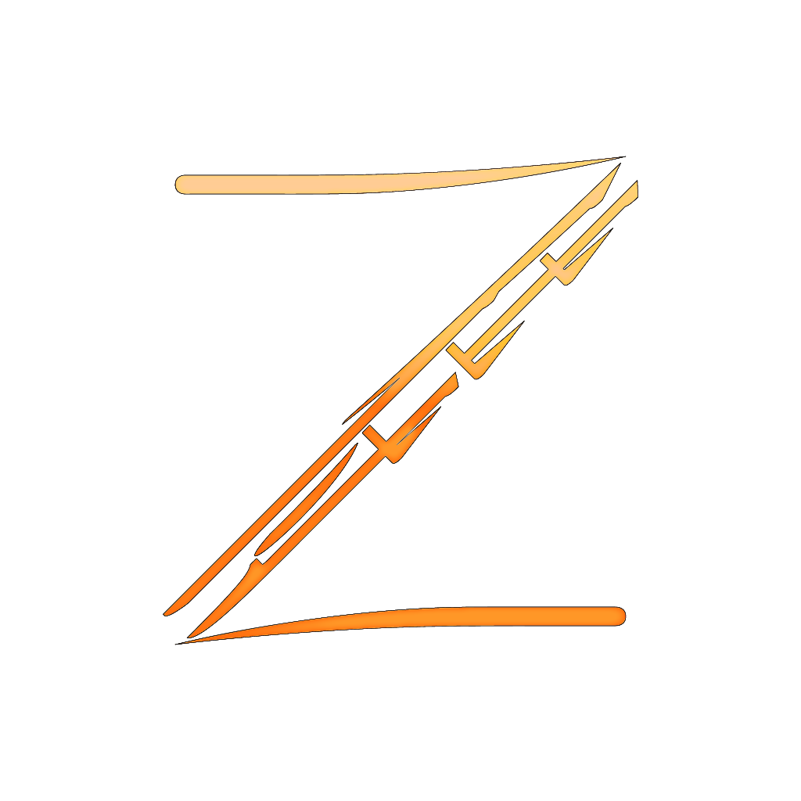

  
  <h1>Samurai</h1>
  
  
  
An Discord bot for BitZeny users.

## License

[MIT License](LICENSE)

## References

<dl>
  <dt><a href="https://github.com/RogueException/Discord.Net">RougeException/Discord.Net</a></dt>
  <dd><a href="https://github.com/RogueException/Discord.Net/blob/dev/LICENSE">MIT License</a></dd>
</dl>

## Donation

<dl>
  <dt>BitZeny</dt>
  <dd>ZkVu5VUZTeQgnVRftuBdKgWhMiUah4jLEb</dd>
</dl>
<dl>
  <dt>Monacoin</dt>
  <dd>MFD19r24ZEkqGTtdmu3UPDgqLAy4Paiujh</dd>
</dl>
